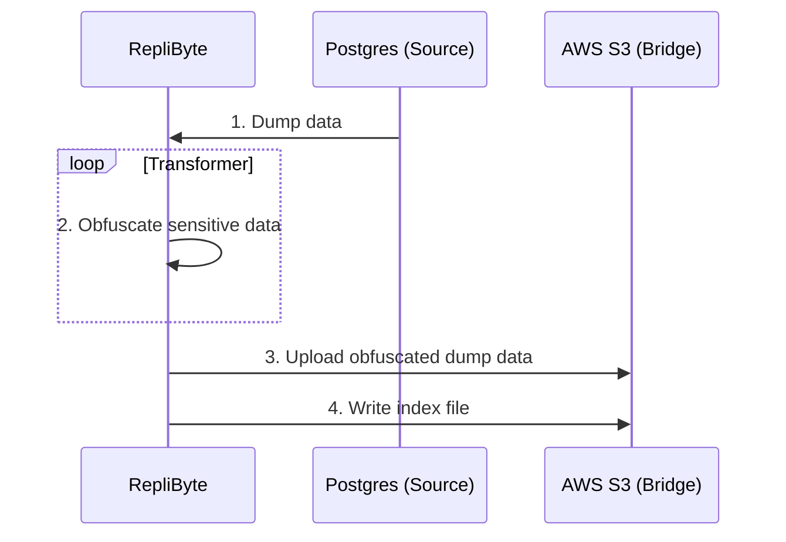
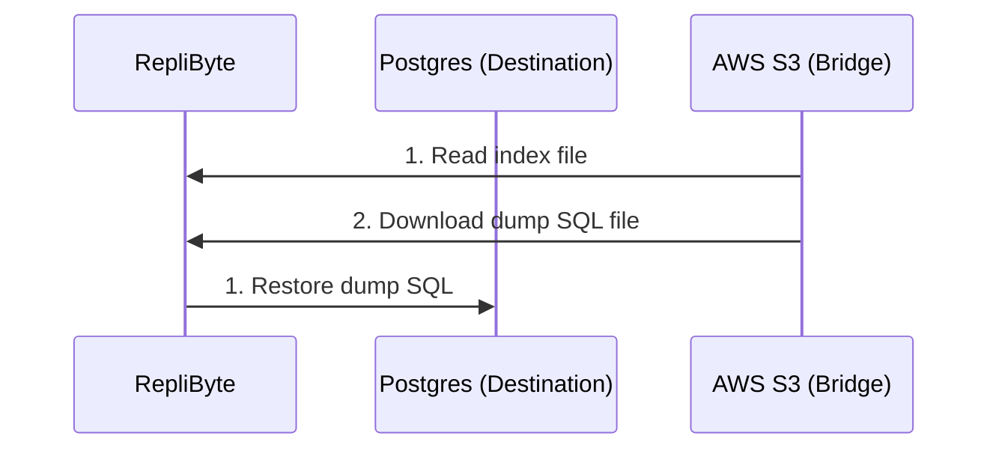

<h3 align="center">The Simplest Way To Synchronize Your Cloud Databases</h3>
<p align="center">Replibyte is a standalone application to replicate your cloud databases </br>from one place to the other while hiding sensitive data 🕵️‍♂️</p>

<p align="center">


<a href="https://discord.qovery.com">  </a>
</p>

---------

**⚠️ DEVELOPMENT IN PROGRESS - CONTRIBUTORS WANTED!! [JOIN DISCORD](https://discord.qovery.com)**

---------

## Motivation

At [Qovery](https://www.qovery.com) (the company behind RepliByte), developers can clone their applications and databases in one click. The
problem is that when they clone them, the data from the databases are not duplicated. Cloning data can be tedious, and we end up reinventing
the wheel. With RepliByte, the Qovery team wants to provide a comprehensive way to replicate cloud databases from one place to the other.

## Use cases

RepliByte is built to respond to the following use cases:

| scenario                                                             | supported |
|----------------------------------------------------------------------|-----------|
| Synchronize full Postgres instance and obfuscate sensitive data      | WIP       |
| Synchronize specific Postgres databases and obfuscate sensitive data | WIP       |
| Synchronize specific Postgres tables and obfuscate sensitive data    | WIP       |
| ...                                                                  | ...       |

> Do you want to support an additional use-case? Feel free to [contribute](#contributing) by opening an issue or submitting a PR.

## Usage example

### Source

Create your `prod-conf.yaml` configuration file to source your production database.

```yaml
bind: 127.0.0.1
port: 1337
source:
  connection_uri: $DATABASE_URL
  cron: 0 3 * * * # every day at 3 am
  transformers:
    - database: public
      table: employees
      columns:
        - name: last_name
          transformer: random
        - name: birth_date
          transformer: random-date
bridge:
  type: s3
  bucket: $BUCKET_NAME
  access_key_id: $ACCESS_KEY_ID
  secret_access_key: $AWS_SECRET_ACCESS_KEY
```

Run the app for the source

```shell
replibyte -c prod-conf.yaml
```

### Destination

Create your `staging-conf.yaml` configuration file to sync your production database with your staging database.

```yaml
bind: 127.0.0.1
port: 1338
bridge:
  - type: s3
    bucket: $BUCKET_NAME
    access_key_id: $ACCESS_KEY_ID
    secret_access_key: $AWS_SECRET_ACCESS_KEY
destination:
  connection_uri: $DATABASE_URL
  cron: 0 5 * * * # every day at 5 am
```

Run the app for the destination

```shell
replibyte -c staging-conf.yaml
```

## How RepliByte works

RepliByte is built to replicate small and very large databases from one place (source) to the other (destination) with a bridge as
intermediary (bridge). Here is an example of what happens while replicating a Postgres database.



1. RepliByte connects to the *Postgres Source* database and make a full SQL dump of it.
2. RepliByte receive the SQL dump, parse it, and obfuscate the sensitive data in real-time.
3. RepliByte stream and upload the modified SQL dump in real-time on AWS S3.
4. RepliByte keep track of the uploaded SQL dump by writing into an index file.

---

Once at least a replica from the source Postgres database is available on the S3 bucket, then RepliByte can use it and inject it into the
destination Postgres.



1. RepliByte connects to the S3 bucket and read the index file to retrieve the latest SQL to download.
2. RepliByte download the SQL dump in a stream bytes.
3. RepliByte restore the SQL dump in the destination Postgres database in real-time.

## Features

- [x] Full data synchronization
- [x] Backup TB of data (read [Design](#design))
- [x] Work on different VPC / network
- [x] Obfuscate sensitive data

Here are the features we plan to support

- [ ] Incremental data synchronization

## Connectors

### Sources

Supported sources connectors:

- [x] Postgres
- [ ] MySQL (not started)
- [ ] MongoDB (not started)

### Bridge

Connector to make the bridge between sources and destinations.

- [ ] S3 (WIP)

The S3 wire protocol is supported by most of the cloud providers. Here is a non-exhaustive list of S3 compatible services.

| Cloud Service Provider | S3 service name                                                           | S3 compatible  |
|------------------------|---------------------------------------------------------------------------|----------------|
| Amazon Web Services    | [S3](https://aws.amazon.com/s3/)                                          | Yes (Original) |
| Google Cloud Platform  | [Cloud Storage](https://cloud.google.com/storage)                         | Yes            |  
| Microsoft Azure        | [Blob Storage](https://azure.microsoft.com/en-us/services/storage/blobs/) | Yes            |
| Digital Ocean          | [Spaces](https://www.digitalocean.com/products/spaces)                    | Yes            |
| Scaleway               | [Object Storage](https://www.scaleway.com/en/object-storage/)             | Yes            |
| ...                    | ...                                                                       | ...            |

*Feel free to drop a PR to include another s3 compatible solution.*

### Destinations

Supported dest connectors:

- [ ] Postgres (WIP)
- [ ] MySQL (not started)
- [ ] MongoDB (not started)

## Design

Here are the design choices made for RepliByte:

### Low Memory and CPU footprint

Written in Rust, RepliByte can run with 512 MB of RAM and 1 CPU to replicate 1 TB of data. RepliByte replicate the data in a stream of bytes
and does not store anything on a local disk. 

### Limitations

*We'll put all the limitations we are facing here*

- At the moment we have no benchmark - they will come as soon as we move forward.

## What is not RepliByte

### RepliByte is not an ETL

RepliByte is not an ETL like [AirByte](https://github.com/airbytehq/airbyte), [AirFlow](https://airflow.apache.org/), Talend, and it will
never be. If you need to synchronize versatile data sources, you are better choosing a classic ETL. RepliByte is a tool for software
engineers to help them to synchronize data from the same databases. With RepliByte, you can only replicate data from the same type of
databases. As mentioned above, the primary purpose of RepliByte is to duplicate into different environments. You can see RepliByte as a
specific use case of an ETL, where an ETL is more generic.

### RepliByte is not a database backup tool

Even if you can use RepliByte as a database backup tool, we have not designed it this way. It might change in the future, but at the moment
RepliByte has not been designed to make all the checks needed to guarantee that the backup is consistent.


## FAQ

⬆️ *Open an issue if you have any question - I'll pick the most common questions and put them here with the answer*

# Contributing

## Local development

To develop in local, you need to install and run [Docker](https://www.docker.com/) and then run `docker-compose up` to start local
databases. At the moment, the docker-compose includes 2 postgres database instances. One source and one destination. In the future, we'll
provide more options.

Once your docker instances are running, you can run the RepliByte tests.

```shell
cargo test
```

## How to contribute

RepliByte is in its early stage of development and need some time to be usable in production. We need some help, and you are welcome to
contribute. To better synchronize consider joining our #replibyte channel on our [Discord](https://discord.qovery.com). Otherwise, you can
pick any open issues and contribute.

Any questions? drop us an email to `github+replibyte {at} qovery {dot} com`

## Live Coding Session

Romaric, main contributor to RepliByte does some [live coding session on Twitch](https://www.twitch.tv/codewithromaric) to learn more about
RepliByte and explain how to develop in Rust. Feel free to [join the sessions](https://www.twitch.tv/codewithromaric).

## Thanks

Thanks to all people sharing their ideas to make RepliByte better. We do appreciate it. I would also thank [AirByte](https://airbyte.com/),
a great product and a trustworthy source of inspiration for this project.  
