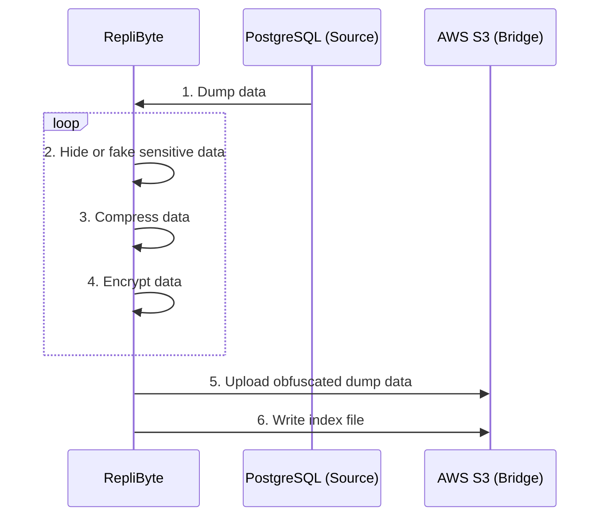
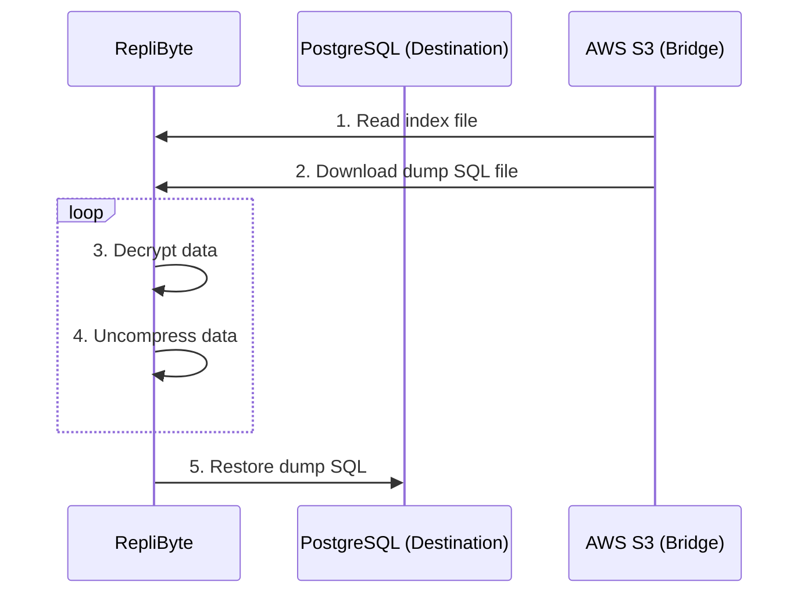

<p align="center">  </p>

<h3 align="center">The Simplest Way To Synchronize Your Cloud Databases</h3>
<p align="center">Replibyte is an application to replicate your cloud databases </br>from one place to the other while hiding sensitive data 🕵️‍♂️</p>

<p align="center">


<a href="https://discord.qovery.com">  </a>
</p>

## Install


<details>

<summary>Install on MacOSX</summary>

```shell
brew tap Qovery/replibyte
brew install replibyte
```

Or [manually](https://github.com/Qovery/replibyte/releases).

</details>

<details>

<summary>Install on Linux</summary>

```shell
# download latest replibyte archive for Linux
curl -s https://api.github.com/repos/Qovery/replibyte/releases/latest | \
    jq -r '.assets[].browser_download_url' | \
    grep -i 'linux-musl.tar.gz$' | wget -qi - && \

# unarchive
tar zxf *.tar.gz

# make replibyte executable
chmod +x replibyte

# make it accessible from everywhere
mv replibyte /usr/local/bin/
```
</details>

<details>

<summary>Install on Windows</summary>

Download [the latest Windows release](https://github.com/Qovery/replibyte/releases) and install it.

</details>

<details>

<summary>Run with Docker</summary>

### Docker

```shell
git clone https://github.com/Qovery/replibyte.git

# Build image with Docker
docker build -t replibyte -f Dockerfile .

# Run RepliByte
docker run -v $(pwd)/examples:/examples/ replibyte -c /examples/replibyte.yaml transformer list
```

Feel free to edit `./examples/replibyte.yaml` with your configuration.

</details>

## Features

- [x] Complete data synchronization
- [x] Work on different VPC/network
- [x] Generate random/fake information
- [x] Backup TB of data (read [Design](#design))
- [x] Skip data sync for specific tables
- [x] On-the-fly data (de)compression (Zlib)
- [x] On-the-fly data de/encryption (AES-256)

Here are the features we plan to support

- [ ] Incremental data synchronization
- [ ] Auto-detect sensitive fields and generate fake data
- [ ] Auto-clean up bridge data


## Usage

[](https://www.youtube.com/watch?v=IKeLnZvECQw)

Example with PostgreSQL as a *Source* and *Destination* database **AND** S3 as a *Bridge* (cf [configuration file](#Configuration))

Backup your PostgreSQL databases into S3

```shell
replibyte -c prod-conf.yaml backup run
```

Backup from local PostgreSQL dump file into S3

```shell
cat dump.sql | replibyte -c prod-conf.yaml backup run -s postgres -i
```

Restore your PostgreSQL databases from S3

```shell
replibyte -c prod-conf.yaml backup list

type          name                    size    when                    compressed  encrypted
PostgreSQL    backup-1647706359405    154MB   Yesterday at 03:00 am   true        true
PostgreSQL    backup-1647731334517    152MB   2 days ago at 03:00 am  true        true
PostgreSQL    backup-1647734369306    149MB   3 days ago at 03:00 am  true        true
```

```shell
replibyte -c prod-conf.yaml restore -v latest

OR 

replibyte -c prod-conf.yaml restore -v backup-1647706359405
```

### Configuration

Create your `prod-conf.yaml` configuration file to source your production database.

```yaml
source:
  connection_uri: $DATABASE_URL
  encryption_key: $MY_PRIVATE_ENC_KEY # optional 
  transformers:
    - database: public
      table: employees
      columns:
        - name: last_name
          transformer_name: random
        - name: birth_date
          transformer_name: random-date
        - name: first_name
          transformer_name: first-name
        - name: email
          transformer_name: email
        - name: username
          transformer_name: keep-first-char
    - database: public
      table: customers
      columns:
        - name: phone
          transformer_name: phone-number
bridge:
  bucket: $BUCKET_NAME
  region: $S3_REGION
  access_key_id: $ACCESS_KEY_ID
  secret_access_key: $AWS_SECRET_ACCESS_KEY
```

Run the app for the source

```shell
replibyte -c prod-conf.yaml
```

### Destination

Create your `staging-conf.yaml` configuration file to sync your production database with your staging database.

```yaml
bridge:
  bucket: $BUCKET_NAME
  region: $S3_REGION
  access_key_id: $ACCESS_KEY_ID
  secret_access_key: $AWS_SECRET_ACCESS_KEY
destination:
  connection_uri: $DATABASE_URL
  decryption_key: $MY_PUBLIC_DEC_KEY # optional
```

Run the app for the destination

```shell
replibyte -c staging-conf.yaml
```

## How RepliByte works

RepliByte is built to replicate small and very large databases from one place (source) to the other (destination) with a bridge as
intermediary (bridge). Here is an example of what happens while replicating a PostgreSQL database.



1. RepliByte connects to the _PostgreSQL Source_ database and makes a full SQL dump of it.
2. RepliByte receives the SQL dump, parse it, and generates random/fake information in real-time.
3. RepliByte streams and uploads the modified SQL dump in real-time on AWS S3.
4. RepliByte keeps track of the uploaded SQL dump by writing it into an index file.

---

Once at least a replica from the source PostgreSQL database is available in the S3 bucket, RepliByte can use and inject it into the
destination PostgreSQL database.



1. RepliByte connects to the S3 bucket and reads the index file to retrieve the latest SQL to download.
2. RepliByte downloads the SQL dump in a stream bytes.
3. RepliByte restores the SQL dump in the destination PostgreSQL database in real-time.

## Connectors

### Supported Source connectors

- [x] PostgreSQL
- [x] MongoDB
- [ ] MySQL (Coming Soon)
- [x] Local dump file (Yes for PostgreSQL)

### Supported Transformers

A transformer is useful to change / hide the value of a column. RepliByte provides pre-made transformers.

Check out the [list of our available Transformers](TRANSFORMERS.md)

### RepliByte Bridge

The S3 wire protocol, used by RepliByte bridge, is supported by most cloud providers. Here is a non-exhaustive list of S3 compatible
services.

| Cloud Service Provider | S3 service name                                                           | S3 compatible  |
|------------------------|---------------------------------------------------------------------------|----------------|
| Amazon Web Services    | [S3](https://aws.amazon.com/s3/)                                          | Yes (Original) |
| Google Cloud Platform  | [Cloud Storage](https://cloud.google.com/storage)                         | Yes            |
| Microsoft Azure        | [Blob Storage](https://azure.microsoft.com/en-us/services/storage/blobs/) | Yes            |
| Digital Ocean          | [Spaces](https://www.digitalocean.com/products/spaces)                    | Yes            |
| Scaleway               | [Object Storage](https://www.scaleway.com/en/object-storage/)             | Yes            |
| Minio                  | [Object Storage](https://min.io/)                                         | Yes            |

> Feel free to drop a PR to include another S3 compatible solution.

### Supported Destination connectors

- [x] PostgreSQL
- [x] MongoDB
- [x] Local dump file
- [ ] MySQL (Coming Soon)

## Design

### Low Memory and CPU footprint

Written in Rust, RepliByte can run with 512 MB of RAM and 1 CPU to replicate 1 TB of data (we are working on a benchmark). RepliByte
replicate the data in a stream of bytes and does not store anything on a local disk.

### Limitations

- Tested with PostgreSQL 13 and 14. It should work with prior versions.
- RepliByte as not been designed to run multiple backups targeting the same Bridge. The Index File does not manage concurrent write (ATM).

### Index file structure

An index file describe the structure of your backups and all of them.

Here is the manifest file that you can find at the root of your target `Bridge` (E.g: S3).

```json
{
  "backups": [
    {
      "size": 1024000,
      "directory_name": "backup-{epoch timestamp}",
      "created_at": "epoch timestamp",
      "compressed": true,
      "encrypted": true
    }
  ]
}
```

* *size* is in bytes
* *created_at* is an epoch timestamp in millis

## Motivation

At [Qovery](https://www.qovery.com) (the company behind RepliByte), developers can clone their applications and databases just with one
click. However, the cloning process can be tedious and time-consuming, and we end up copying the information multiple times. With RepliByte,
the Qovery team wants to provide a comprehensive way to seed cloud databases from one place to another.

The long-term motivation behind RepliByte is to provide a way to clone any database in real-time. This project starts small, but has big
ambition!

## Use cases

| Scenario                                                                                    | Supported |
|---------------------------------------------------------------------------------------------|-----------|
| Synchronize the whole PostgreSQL/MongoDB instance                                           | Yes       |
| Synchronize the whole PostgreSQL/MongoDB instance and replace sensitive data with fake data | Yes       |
| Synchronize specific PostgreSQL/MongoDB tables and replace sensitive data with fake data    | Yes       |
| Synchronize specific PostgreSQL/MongoDB databases and replace sensitive data with fake data | Yes       |
| Migrate from one database hosting platform to the other                                     | Yes       |

> Do you want to support an additional use-case? Feel free to [contribute](#contributing) by opening an issue or submitting a PR.

## What is not RepliByte

### RepliByte is not an ETL

RepliByte is not an ETL like [AirByte](https://github.com/airbytehq/airbyte), [AirFlow](https://airflow.apache.org/), Talend, and it will
never be. If you need to synchronize versatile data sources, you are better choosing a classic ETL. RepliByte is a tool for software
engineers to help them to synchronize data from the same databases. With RepliByte, you can only replicate data from the same type of
databases. As mentioned above, the primary purpose of RepliByte is to duplicate into different environments. You can see RepliByte as a
specific use case of an ETL, where an ETL is more generic.

## FAQ

### Q: Do you support backup from a dump file?

Answer: absolutely,

```shell
cat dump.sql | replibyte -c prod-conf.yaml backup run -s postgres -i
```

and

```shell
replibyte -c prod-conf.yaml backup run -s postgres -f dump.sql
```

### How RepliByte can list the backups? Is there an API?

There is no API, RepliByte is fully stateless and store the backup list into the bridge (E.g. S3) via an [index_file](#index-file-structure)
.

---

⬆️ _Open an issue if you have any question - I'll pick the most common questions and put them here with the answer_

# Contributing

## Local development

For local development, you will need to install [Docker](https://www.docker.com/) and
run `docker compose -f ./docker-compose-postgres-minio.yml` to start the local databases. At the moment, `docker-compose` includes 2
PostgreSQL database instances and a [Minio](https://min.io/) bridge. One source, one destination database and one bridge. In the future, we
will provide more options.

The Minio console is accessible at http://localhost:9001.

Once your Docker instances are running, you can run the RepliByte tests, to check if everything is configured correctly:

```shell
AWS_ACCESS_KEY_ID=minioadmin AWS_SECRET_ACCESS_KEY=minioadmin cargo test
```

## How to contribute

RepliByte is in its early stage of development and need some time to be usable in production. We need some help, and you are welcome to
contribute. To better synchronize consider joining our #replibyte channel on our [Discord](https://discord.qovery.com). Otherwise, you can
pick any open issues and contribute.

### Where should I start?

Check the open [issues](https://github.com/Qovery/replibyte/issues) and their priority.

### How can I contact you?

3 options:

1. Open an [issue](https://github.com/Qovery/replibyte/issues).
2. Join our #replibyte channel on [our discord](https://discord.qovery.com).
3. Drop us an email to `github+replibyte {at} qovery {dot} com`.

## Live Coding Session

Romaric, main contributor to RepliByte does some [live coding session on Twitch](https://www.twitch.tv/codewithromaric) to learn more about
RepliByte and explain how to develop in Rust. Feel free to [join the sessions](https://www.twitch.tv/codewithromaric).

## Thanks

Thanks to all people sharing their ideas to make RepliByte better. We do appreciate it. I would also thank [AirByte](https://airbyte.com/),
a great product and a trustworthy source of inspiration for this project.
