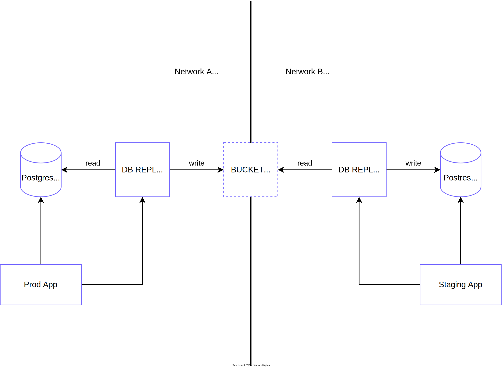

Replibyte is a standalone application to replicate your cloud databases from one place to the other.

---------

**⚠️ DEVELOPMENT IN PROGRESS - NOT PRODUCTION READY YET!!**

---------

## Motivation

At [Qovery](https://www.qovery.com) (the company behind RepliByte), developers can clone their applications and databases in one click. The problem is that when they clone them, the data from the databases are not duplicated. Cloning data can be tedious, and we end up reinventing the wheel. With RepliByte, the Qovery team wants to provide a comprehensive way to replicate cloud databases from one place to the other.

## Use cases

RepliByte is built to respond to the following use cases:

| scenario                                                             | supported       |
|----------------------------------------------------------------------|-----------------|
| Synchronize full Postgres instance and obfuscate sensitive data      | WIP             |
| Synchronize specific Postgres databases and obfuscate sensitive data | WIP             |
| Synchronize specific Postgres tables and obfuscate sensitive data    | WIP             |

> Do you want to support an additional use-case? Feel free to [contribute](#contributing) by opening an issue or submitting a PR.

## Usage example

### Source

Create your `prod-conf.yaml` configuration file to source your production database.

```yaml
bind: 127.0.0.1
port: 1337
source:
  - type: postgres
    connection_uri: $DATABASE_URL
    cron: 0 3 * * * # every day at 3 am
  transformation:
    tables:
      employees:
        - column: last_name
          type: string
          transformer: random 
        - column: birth_date
          type: date
          transformer: date-day
bridge:
  - type: s3
    bucket: $BUCKET_NAME
    access_key_id: $ACCESS_KEY_ID
    secret_access_key: $AWS_SECRET_ACCESS_KEY
```

Run the app for the source

```shell
replibyte -c prod-conf.yaml
```

### Destination

Create your `staging-conf.yaml` configuration file to sync your production database with your staging database.

```yaml
bind: 127.0.0.1
port: 1338
bridge:
  - type: s3
    bucket: $BUCKET_NAME
    access_key_id: $ACCESS_KEY_ID
    secret_access_key: $AWS_SECRET_ACCESS_KEY
destination:
  - type: postgres
    connection_uri: $DATABASE_URL
    cron: 0 5 * * * # every day at 5 am
```

Run the app for the destination

```shell
replibyte -c staging-conf.yaml
```

## Demo

*coming soon*

## Features

Here are the features we plan to support

- [ ] Incremental data synchronization
- [ ] Obfuscate sensitive data

## Connectors



### Sources

Supported sources connectors:

- [ ] Postgres (RDS compatible)

### Bridge

Connector to make the bridge between sources and destinations.

- [ ] S3

### Destinations

Supported dest connectors:

- [ ] Postgres (RDS compatible)

## Design

*coming soon*

## FAQ

⬆️ *Open an issue if you have any question - I'll pick the most common questions and put them here with the answer*

# Contributing

## How to contribute

*coming soon*

## Local development

Run

```shell
docker-compose up
```
