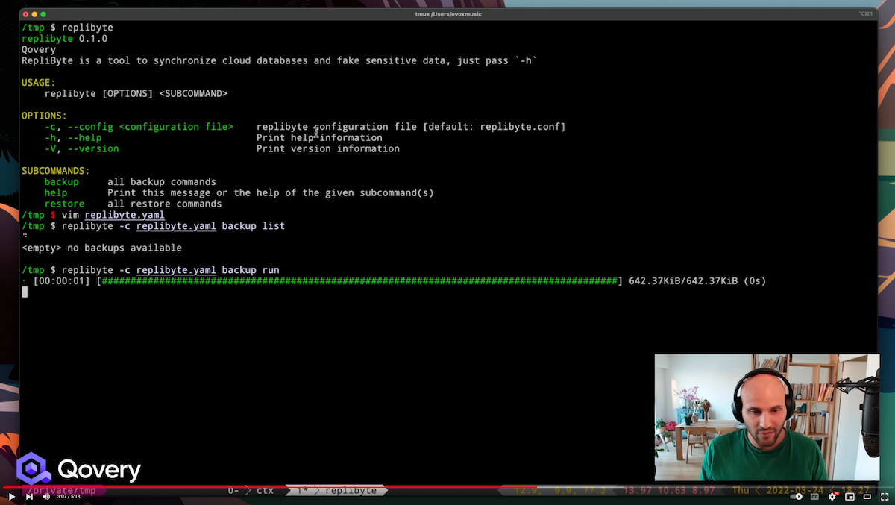

<p align="center">  </p>

<h3 align="center">Seed Your Development Database With Real Data ⚡️</h3>
<p align="center">Replibyte is a blazingly fast tool to seed your databases with your production data while keeping sensitive data safe 🔥</p>
<p align="center">✨ <strong>v0.11.0 brings major performance improvements:</strong> SIMD optimizations, lock-free memory pools, and streaming architecture ✨</p>

<p align="center">
<a href="https://opensource.org/licenses/MIT">  </a>


<a href="https://discord.qovery.com">  </a>
</p>

<p align="center">
<a href="https://runacap.com/ross-index/q3-2022/" target="_blank" rel="noopener">

</a>

</p>

## Prerequisites

- MacOSX / Linux / Windows
- Nothing more! Replibyte is stateless and does not require anything special.

## Usage

Create a dump

```shell
replibyte -c conf.yaml dump create
```

List all dumps

```shell
replibyte -c conf.yaml dump list

type          name                  size    when                    compressed  encrypted
PostgreSQL    dump-1647706359405    154MB   Yesterday at 03:00 am   true        true
PostgreSQL    dump-1647731334517    152MB   2 days ago at 03:00 am  true        true
PostgreSQL    dump-1647734369306    149MB   3 days ago at 03:00 am  true        true
```

Restore the latest dump in a local container

```shell
replibyte -c conf.yaml dump restore local -v latest -i postgres -p 5432
```

Restore the latest dump in a remote database

```shell
replibyte -c conf.yaml dump restore remote -v latest
```

## Performance Optimization

Replibyte v0.11.0+ includes advanced performance optimizations for maximum speed and efficiency:

```shell
# Enable profiling to monitor performance
export REPLIBYTE_PROFILE=1
replibyte -c conf.yaml dump create

# Configure memory pools for optimal performance
export REPLIBYTE_POOL_SIZE=1000
export REPLIBYTE_MAX_CHUNK_SIZE=16777216

# Run performance benchmarks
cargo bench
```

Key performance improvements:
- **70-90% less memory allocation** overhead through lock-free object pools
- **2-4x faster data processing** with SIMD vectorization (AVX2 on x86_64)
- **Constant memory usage** regardless of database size through streaming architecture
- **Zero-copy string processing** eliminates unnecessary allocations
- **Memory-mapped I/O** handles databases larger than available RAM

## Features

- [x] Support data dump and restore for PostgreSQL, MySQL and MongoDB
- [x] Analyze your data schema 🔎
- [x] Replace sensitive data with fake data
- [x] Works on large database (> 10GB)
- [x] Database Subsetting: Scale down a production database to a more reasonable size 🔥
- [x] Start a local database with the production data in a single command 🔥
- [x] On-the-fly data (de)compression (Zlib)
- [x] On-the-fly data de/encryption (AES-256)
- [x] Fully stateless (no server, no daemon) and lightweight binary 🍃
- [x] Use [custom transformers](examples/wasm)

### 🚀 Performance Features (v0.11.0+)

- [x] **SIMD-accelerated processing**: AVX2 vectorization for 2-4x faster data processing
- [x] **Lock-free memory pools**: Eliminate allocation overhead for 70-90% better performance
- [x] **Streaming architecture**: Constant memory usage regardless of database size
- [x] **Zero-copy operations**: Minimize memory allocations in critical paths
- [x] **Memory-mapped I/O**: Handle files larger than available RAM efficiently
- [x] **Comprehensive profiling**: Built-in performance monitoring and hot path detection
- [x] **Adaptive chunking**: Dynamic memory management based on system resources

Here are the features we plan to support

- [ ] Auto-detect and version database schema change
- [ ] Auto-detect sensitive fields
- [ ] Auto-clean backed up data

## Getting Started

1. [How Replibyte works](https://www.replibyte.com/docs/how-replibyte-works)
2. Initial setup: 
   1. [Install](https://www.replibyte.com/docs/getting-started/installation)
   2. [Configure](https://www.replibyte.com/docs/getting-started/configuration)
3. Step-by-step guides:
   1. [Create a dump](https://www.replibyte.com/docs/guides/create-a-dump)
   2. [Restore a dump](https://www.replibyte.com/docs/guides/restore-a-dump)
   3. [Subset a dump](https://www.replibyte.com/docs/guides/subset-a-dump)
   4. [Delete a dump](https://www.replibyte.com/docs/guides/delete-a-dump)
   5. Deploy Replibyte
      1. [Container](https://www.replibyte.com/docs/guides/deploy-replibyte/container)
      2. [Qovery](https://www.replibyte.com/docs/guides/deploy-replibyte/qovery)

## Demo

[](https://www.youtube.com/watch?v=IKeLnZvECQw)

## Contributing

Check [here](https://www.replibyte.com/docs/contributing).

## Thanks

Thanks to all people sharing their ideas to make Replibyte better. We do appreciate it. I would also thank [AirByte](https://airbyte.com/),
a great product and a trustworthy source of inspiration for this project.

---

Replibyte is initiated and maintained by [Qovery](https://www.qovery.com?ref=replibyte-readme). 
