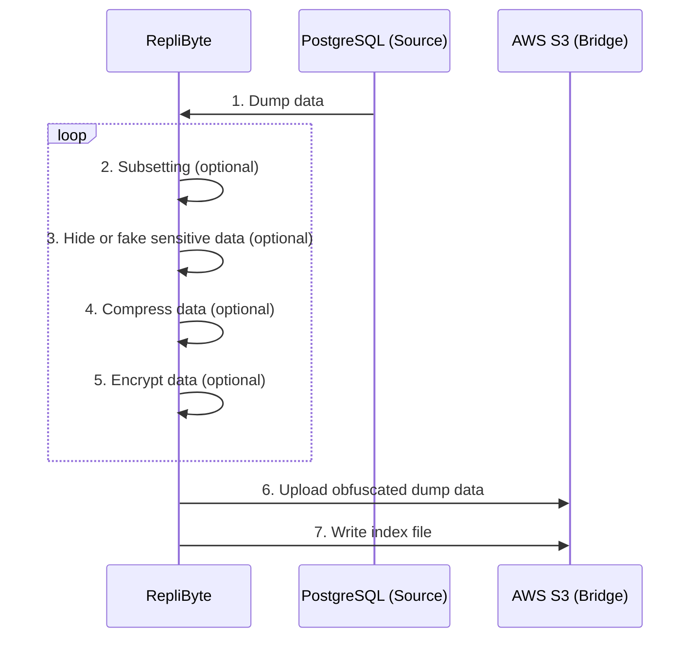
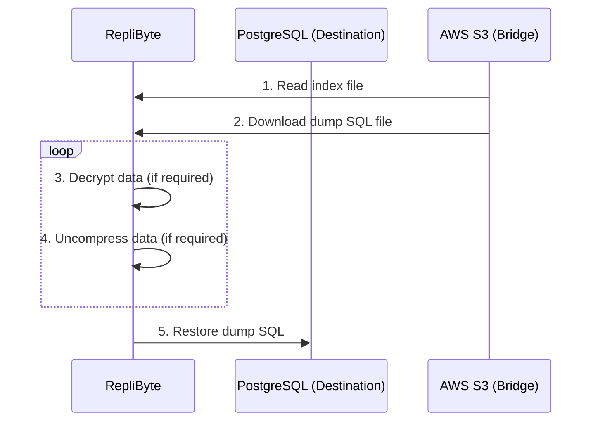

## How RepliByte works

RepliByte is built to replicate small and very large databases from one place (source) to the other (destination) with a bridge as
intermediary (bridge). Here is an example of what happens while replicating a PostgreSQL database.



1. RepliByte connects to the _PostgreSQL Source_ database and makes a full SQL dump of it.
2. RepliByte receives the SQL dump, parse it, and generates random/fake information in real-time.
3. RepliByte streams and uploads the modified SQL dump in real-time on AWS S3.
4. RepliByte keeps track of the uploaded SQL dump by writing it into an index file.

---

Once at least a replica from the source PostgreSQL database is available in the S3 bucket, RepliByte can use and inject it into the
destination PostgreSQL database.



1. RepliByte connects to the S3 bucket and reads the index file to retrieve the latest SQL to download.
2. RepliByte downloads the SQL dump in a stream bytes.
3. RepliByte restores the SQL dump in the destination PostgreSQL database in real-time.

## Design

### Low Memory and CPU footprint

Written in Rust, RepliByte can run with 512 MB of RAM and 1 CPU to replicate 1 TB of data (we are working on a benchmark). RepliByte
replicate the data in a stream of bytes and does not store anything on a local disk.

### Limitations

- Tested with PostgreSQL 13 and 14. It should work with prior versions.
- RepliByte as not been designed to run multiple dumps targeting the same Bridge. The Index File does not manage concurrent write (ATM).

### Index file structure

An index file describe the structure of your dumps and all of them.

Here is the manifest file that you can find at the root of your target `Bridge` (E.g: S3).

```json
{
  "dumps": [
    {
      "size": 1024000,
      "directory_name": "dump-{epoch timestamp}",
      "created_at": "epoch timestamp",
      "compressed": true,
      "encrypted": true
    }
  ]
}
```

- _size_ is in bytes
- _created_at_ is an epoch timestamp in millis
