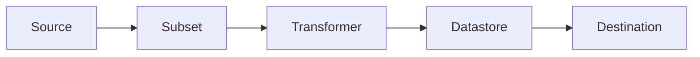

# Concepts

To better use Replibyte, here are a list of the different concept to have in mind.

:::tip

I assume you read "[How Replibyte works](/docs/how-replibyte-works)"

:::

## Source

A source is a database from where Replibyte will create the dump. The database dump can be provided from a file, as a process
input or be created by Replibyte.

## Subset

Subsetting data is the process of taking a representative sample of your data in a manner that preserves the integrity of your database, e.g., give me 5% of all transactions or pull all data associated with customers who live in California. If you do this naively, your database will break foreign key constraints, or you’ll end up with a statistically non-representative data sample. Here are a few situations in which you might find subsetting data to be important or necessary:
1. You’d like to use your production database in staging or test environments but the database is very large so you want to use only a portion of it.
2. You’d like a test database that contains a few specific rows from production (and related rows from other tables) so you can reproduce a bug.
3. You want to share data with others, but you don’t want them to have all of it. A common scenario is providing developers an anonymized subset which also enables them to run the test database locally on their own machines.

## Transformer

A transformer is a module to alternate the value of a specified column. Replibyte provides pre-made [transformers](/docs/transformers). You can also [build your own Transformer in web assembly](/docs/transformers#wasm).

## Datastore

A datastore is where the source dump is stored. E.g a dump can store into a S3 datastore or on a local hard drive.

## Destination

A destination is a database where the dump will is restored.
