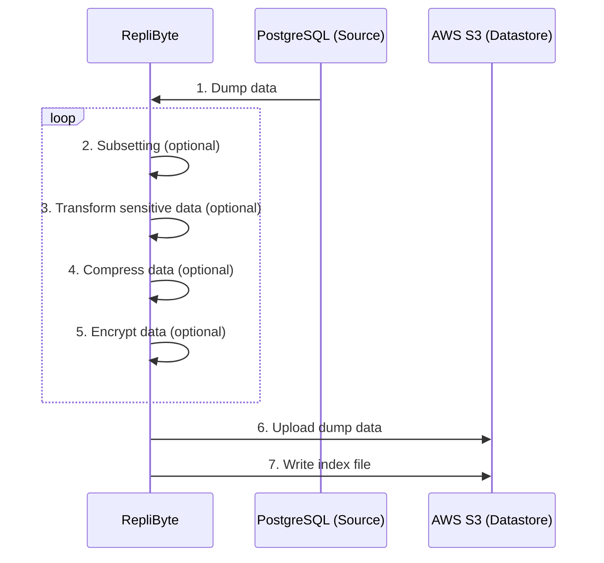
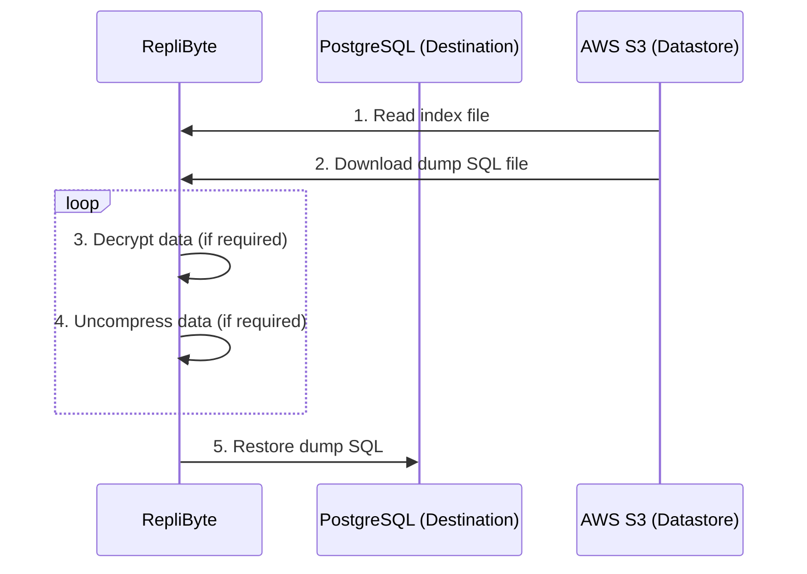

# How Replibyte works

RepliByte is built to seed a development database with production data. Replibyte helps you to:

1. Create a development dump from production
2. [Subset](/docs/design/how-database-subset-works) your production dump into a more reasonable size.
3. Hide sensitive data via customizable [Transformers](/docs/transformers).
4. Make your development dump easily accessible from any remote and local databases.

## How creating a Replibyte dump works

Here is an example of what happens while replicating a PostgreSQL database.

1. RepliByte connects to the PostgreSQL Source database and makes a full SQL dump of it.
2. RepliByte receives the SQL dump, parse it, and generates random/fake information in real-time.
3. RepliByte streams and uploads the modified SQL dumps in real-time on AWS S3.
4. RepliByte keeps track of the uploaded SQL dumps by writing it into an index file.

## How loading a Replibyte dump works

Once at least a replica from the source PostgreSQL database is available in the S3 bucket, RepliByte can use and inject it into the
destination PostgreSQL database.

1. RepliByte connects to the S3 bucket and reads the index file to retrieve the latest SQL to download.
2. RepliByte downloads the SQL dump in a stream bytes.
3. RepliByte restores the SQL dump in the destination PostgreSQL database in real-time.

